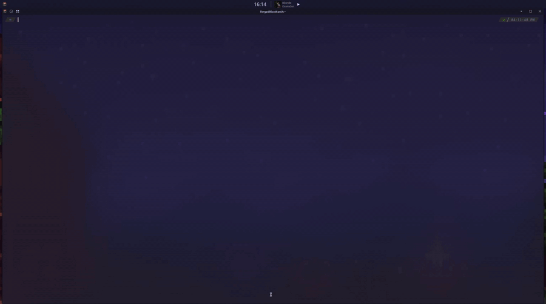
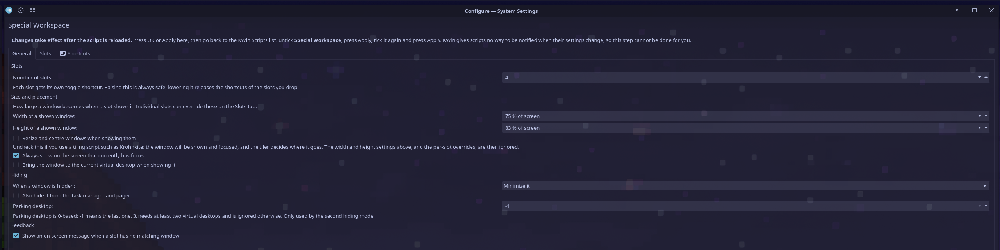

# Special Workspace

A KWin script for KDE Plasma 6 — hide any window and toggle it back with a keypress. Special workspaces, sometimes called scratchpads, inspired by Hyprland.

Bind a window to a key. Press it and the window appears, centered and sized to your screen. Press it again and the window disappears — not closed, not buried behind other windows, just gone until you want it back. Your music player, your terminal, your chat client, one keypress each.

Unlike Hyprland's `togglespecialworkspace`, this moves a single window rather than a whole workspace, so each slot is independent.



---

## Features

- **One key per window**, and it works both ways — press to show, press again to hide
- **Up to 12 independent slots**, with only as many shortcuts registered as you actually use
- **Flexible window matching** — by class, name or title, with substrings, wildcards, regular expressions and alternatives
- **Built-in window inspector** — an optional shortcut that shows any window's class, name and title on screen, so you know exactly what to type into a matcher
- **Multi-monitor aware** — a hidden window comes back on the screen you are looking at now, not the one it left from
- **Configurable size** per slot, as a percentage of the usable screen area, so panels are never covered
- **Two hiding modes** — plain minimize, or Hyprland-style parking on a dedicated virtual desktop
- **Panic button** — one shortcut restores everything the script has hidden

---

## Requirements

KDE Plasma **6.0** or later. This script uses the Plasma 6 KWin scripting API (`workspace.windowList`, `workspace.desktops`, `activeWindow`) and will not run on Plasma 5.

---

## Installation

### From the KDE Store (recommended)

**System Settings → Window Management → KWin Scripts → Get New Scripts…**, search for **Special Workspace**, and install.

Or download the `.kwinscript` file from the [KDE Store page](https://store.kde.org/p/2368111/) or the [releases page](https://github.com/Qehbr/kde-special-workspace/releases) and install it with:

```bash
kpackagetool6 --type=KWin/Script --install kde-special-workspace.kwinscript
```

### Manual installation

```bash
git clone https://github.com/Qehbr/kde-special-workspace.git
cd kde-special-workspace
kpackagetool6 --type=KWin/Script --install .
```

To update an existing installation:

```bash
kpackagetool6 --type=KWin/Script --upgrade .
```

To uninstall:

```bash
kpackagetool6 --type=KWin/Script --remove kde-special-workspace
```

**After installing, enable it:** System Settings → Window Management → KWin Scripts → tick **Special Workspace** → Apply.

---

## Getting started

To make `Meta+F1` mean "Spotify", permanently and across reboots, give slot 1 a matcher:

1. **Find out what the window calls itself.** Go to **System Settings → Shortcuts → KWin**, find **Special Workspace: Show focused window's class**, and give it a key — `Meta+Shift+I` is a good choice. Now focus Spotify and press it: an on-screen message shows its class, name and title.
2. **Set the matcher.** Open **System Settings → Window Management → KWin Scripts**, click the ⚙ next to **Special Workspace**, go to the **Slots** tab, and type the class into slot 1's matcher.
3. **Reload.** Untick the script, Apply, tick it again, Apply.

Now `Meta+F1` shows Spotify centered on your screen, and pressing it again hides it. Repeat for slots 2, 3 and 4.

You only need step 1 once per window, which is why that shortcut ships unbound rather than occupying a key on every user's system.

**Need more than four windows?** Raise **Number of slots** on the General tab, then bind the new toggles in System Settings → Shortcuts → KWin.

---

## Window matchers

A matcher is a `|`-separated list of rules. Bare text matches the window's **class or name**, case-insensitively, as a **substring** — which is usually all you need, and is deliberately forgiving because applications report different capitalisation on X11 and Wayland.

| Matcher | Matches |
|---------|---------|
| `spotify` | any window whose class or name contains "spotify" |
| `class:org.kde.dolphin` | class contains `org.kde.dolphin` |
| `name:kitty` | resource name contains `kitty` |
| `title:*Scratch*` | window title matching the wildcard |
| `re:^kitty$` | regular expression — use this for an exact match |
| `spotify\|LM Studio` | either rule matches |

Rules are case-insensitive except `re:`, which is passed to the JavaScript regex engine as written. Any value containing `*` is treated as an anchored wildcard rather than a substring.

**When several windows match**, the slot picks, in order: the window it last acted on, then a matching window it has already hidden, then the topmost match. This means a broad matcher like `kitty` still toggles the *same* terminal every time instead of drifting between them.

---

## Shortcuts

All shortcuts live in **System Settings → Shortcuts → KWin** and can be rebound there.

| Action | Default | Description |
|--------|---------|-------------|
| Toggle slot 1–4 | `Meta+F1`–`F4` | One key both ways: shows the slot's window, or hides it if it is already on the current desktop |
| Toggle slot 5–12 | *unbound* | As above, once you raise the slot count |
| Show focused window's class | *unbound* | On-screen readout of class, name and title — bind it while setting up your slots |
| Restore all hidden windows | *unbound* | Bring back everything the script has hidden |

Only the slots you have configured register a shortcut, so the list stays short. With the default of 4 slots that is six entries in total.

---

## Configuration

System Settings → Window Management → KWin Scripts → ⚙ next to **Special Workspace**.



> ### ⚠ Changes need the script reloaded
>
> After pressing Apply in the settings dialog, go back to the KWin Scripts list, **untick Special Workspace → Apply → tick it again → Apply**.
>
> This is not an oversight. The settings dialog for KWin scripts is `kcm_kwin4_genericscripted`, and its only way to notify anything is the *Effects* DBus interface — it calls `reconfigureEffect(<id>)` on save. A KWin **script** is not an effect, so that call reaches nothing. The settings are written to `kwinrc` correctly, but the running script is never told, and KWin keeps its parsed copy of the config cached, so the script cannot notice the change by re-reading either. Reloading the script is the only way to pick up new settings.

### General

| Setting | Default | Description |
|---------|---------|-------------|
| Number of slots | 4 | How many slots get a toggle shortcut (1–12). See the caveat below before lowering it |
| Width of a shown window | 75% | Width as a percentage of the usable screen area (panels excluded) |
| Height of a shown window | 83% | Height as a percentage of the usable screen area |
| Resize and centre windows when showing them | Enabled | Turn off if you use a tiling script — the window is shown and focused, and the tiler places it. The width, height and per-slot overrides are then ignored |
| Always show on the focused screen | Enabled | Show the window on the monitor you are using now, instead of the one it was hidden from |
| Bring to the current virtual desktop | Enabled | A hidden window follows you back to whichever desktop you are on |
| When a window is hidden | Minimize it | Minimize only, or minimize and park on a virtual desktop |
| Also hide from task manager and pager | Enabled | Makes a hidden window disappear completely rather than sitting minimized in the taskbar |
| Parking desktop | -1 | 0-based index of the parking desktop; -1 means the last one |
| Show on-screen messages | Enabled | Feedback when a slot has no matching window |

### Slots

| Setting | Default | Description |
|---------|---------|-------------|
| Window matcher | *empty* | See [Window matchers](#window-matchers). A slot with an empty matcher does nothing |
| Width | 0% | Per-slot override; 0 uses the General default |
| Height | 0% | Per-slot override; 0 uses the General default |

Rows beyond the configured **Number of slots** are inactive — they have no shortcut, so nothing can trigger them.

---

## Using this with a tiling script

If you run a tiling script such as **Krohnkite** or **Bismuth**, it decides where windows go, and it re-arranges after this script has shown one — so a size and position set here is overwritten a moment later. Turn **Resize and centre windows when showing them** off, and the window will simply be shown and focused for the tiler to place.

Two other settings are worth turning off in that case, because both fire signals that can make a tiler drop the window and re-insert it somewhere new rather than returning it to the slot it held:

- **Bring the window to the current virtual desktop** — assigns `desktops` even when the window is already there
- **Also hide it from the task manager and pager** — flips `skipTaskbar`/`skipPager` on every hide and show

If you would rather keep windows centred, do the opposite: leave centring on and tell the tiler to leave these windows alone. Krohnkite has a **Floating class** list (`floatingClass`) for exactly this — add the window classes you use as scratchpads and its layout will ignore them, so the geometry set here survives. Note that this floats *every* window of those classes, not only the one in the slot.

---

## Notes and caveats

- **Clear a slot's shortcut before lowering the slot count.** Raising the count is free; lowering it is not. Plasma remembers a binding for as long as the action exists, and a slot that is no longer registered disappears from System Settings while *still holding its key* — leaving it reserved by something you can no longer see or edit. So if slot 6 is bound to `Meta+F6` and you drop to 4 slots, `Meta+F6` stays claimed. Unbind it in **System Settings → Shortcuts → KWin** first, while the slot is still listed. (The script cannot do this for you: kglobalaccel's `setShortcut` takes a string list plus a list of key codes, and the scripting API's `callDBus` cannot marshal that signature.)
- **"Also hide from task manager and pager"** sets `skipTaskbar`/`skipPager` on hidden windows and restores the original values when they are shown again. If you disable or uninstall the script while windows are hidden, those flags stay set and the windows remain hidden from the taskbar — they are still reachable via Alt+Tab. Bind **Restore all hidden windows** and press it before disabling the script, or turn this option off if you would rather not have the flags touched at all.
- **Parking mode** needs at least two virtual desktops. With only one configured it silently falls back to plain minimizing. Parked windows are visible if you switch to the parking desktop yourself; that is by design, and mirrors how Hyprland's special workspaces behave.
- Only normal windows can be hidden. Dialogs, panels, docks and notifications are skipped.

---

## Links

- [KDE Store](https://store.kde.org/p/2368111/) — also reachable as [opendesktop.org/p/2368111](https://www.opendesktop.org/p/2368111/); same listing, same backend
- [Releases](https://github.com/Qehbr/kde-special-workspace/releases) — the packaged `.kwinscript`

---

## License

GPL-2.0-or-later — see [LICENSE](LICENSE).

---

## Credits

Author: [Yuriy Rusanov](https://github.com/Qehbr)

Inspired by Hyprland's special workspaces and i3's scratchpad.
